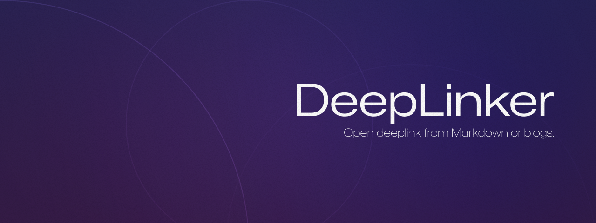

> [!IMPORTANT]  
> This project is still under development, and some features may not work or may be unstable.

||
|-|

## **DeepLink** - Open deeplink from Markdown or blogs.

DeepLinker is a free and open-source redirect service that helps open deep links seamlessly on web and app platforms that only support Markdown or HTTP/HTTPS links.  
It converts app deep links into universal HTTP redirect links that work across all platforms, intelligently detecting the user’s platform and directing them to the appropriate app or an alternative web version.

⚠️ **Important** : Never include sensitive information in a DeepLink. These links are not secure!

## ⭐ Star History

## 📄 License
**MIT License** - Copyright (c) 2025 BACKGWA  
Permission is hereby granted, free of charge, to use, copy, modify, and distribute this software. Feel free to contribute!

